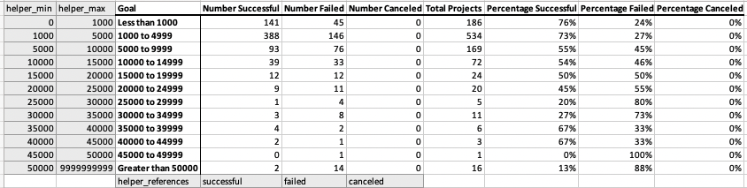

# Kickstart Analysis

**Author:** Luke Alibozek
 
**Date:** 10-DEC-2021

## Overview of Project

Louise has initiated a fundraiser on the Kickstarter platform in support of her play *Fever*. To assist Louise with her fundraising efforts, this project analyzes how similar Kickstarter campaigns fared in relation to their launch dates and fundraising goals. The project aims to extract insights that may help Louise's successfully meet her fundraising goal.

## Analysis and Challenges

This analysis involved collection of fundraising campaign data extracted from Kickstarter, spanning all available campaign categories. The data was then imported into Excel, normalized, sorted, and analyzed to observe trends and outliers.

### Normalizing the Data

**Challenge 1**: The data presented some challenges in terms of data types that were not readily able to be charted. For example, the original date formats for campaign deadlines and launch dates were UNIX timestamps and needed to be converted to a human readable format. 

To do so, new columns were created and the following formula was used: `=((( [referenced_cell] /60)/60)/24)+DATE(1970,1,1)`

**Challenge 2**:Additionally, the column "Category and Subcategory" needed to be split into two columns for easier analysis. To do so, the "Convert Text to Columns" Excel wizard was utilized. 

**Challenge 3**: An unanticipated challenge dealt with the computer OS used for this analysis (macOS), and the analyst's existing familiarity with Excel for Windows OS. Excel for macOS is unfortunately limited in terms of functionality, and when migrating from Windows to Mac there is a considerable amount of relearning that is required, especially if one has become accustomed to keystrokes and quick-access features. Though this project did not involve computation that would have presented a serious challenge on macOS, minor frustrations were present. 
- The lack of Excel charts allowing for filtering directly from the chart itself
- The inability to paste data with keystrokes the same way one would on Windows PC (i.e. quick transpose, paste text only, paste formatting only, etc.).

**Challenge 4**: As will be explained in point 3 under the below heading **The Analysis**, the "Outcomes Based on Goals" analysis was conducted via a manually created pivot table. It featured columns that were designed to calculate counts (and other computations) of campaigns across groupings of goal values. 

 

These ranges as they were written (e.g. "Less than 1000") were, however, not friendly to excel formulas and created a tedious amount of formula building. To minimize the redundancy, helper columns were built.

*Helper columns in grey*

Formulas were built to reference those columns, which in turn allowed for formulas to be dragged and populated in other columns. 
* Example: "Number Successful" column: `=COUNTIFS(Kickstarter!$F:$F,'Outcomes Based on Goals'!D$14,Kickstarter!$R:$R,"plays",Kickstarter!$D:$D,">="&'Outcomes Based on Goals'!$A2,Kickstarter!$D:$D,"<"&'Outcomes Based on Goals'!$B2)`

    

    * `'Outcomes Based on Goals'!D$14` references the helper field below the first three counting columns, which provides the `countif` formula the criteria to count. In this case, it is counting only the successful campaigns from column F in the main Kickstarter sheet. Since the cell that is referenced by `D$14` does not have an absolute reference(`$`) for the column but does for the row, this formula can be dragged across the other countif columns and maintains referential integrity by only pulling from the 14th row beneath each column. 
    * `Kickstarter!$D:$D,">="&'Outcomes Based on Goals'!$A2` and `Kickstarter!$D:$D,"<"&'Outcomes Based on Goals'!$B2`: Helper columns A and B were generated to translate the Goal column (column C) to something that can be referenced in formulas. Again, the placement of absolute references allows these formulas to be dragged.

### The Analysis

The analysis featured the following steps:

1. Normalizing the data, and creating new columns.
    * Splitting the `Category and Subcategory` column into separate columns using the "Text to Column" wizard, choosing the `"/"` character as the delimiter
    * Converting UNIX timestamps found in the `launched_at` and `deadline` columns the into human-readable date formats
        * New columns were created to hold these dates, entitled `Date Created Conversion` and `Date Ended Conversion`
        * The formula `=((( [referenced_cell] /60)/60)/24)+DATE(1970,1,1)` was used in each, corresponding to the appropriate reference column.
    * Using the timestamp conversion columns to extract the campaign Year from the `Date Created Conversion` column.
        * `=YEAR( [referenced_cell] )`

2. Analyzing **Theater Outcomes by Launch Date**
    * A pivot table was created that the following characteristics:
        * Filters for `Parent Category` and `Year`
        * Columns showing Campaign Outcomes, with `live` filtered out so the assessment could only focus on `successful`, `failed`, and `canceled`.
        * Rows featuring `Date Created Conversion`, grouped by month.
    * A line chart was created to visualize trends of campaign success by month.

Click to expand to view graph

    

3. Analyzing Outcomes Based on Goals
    * A table was created that featured rows which grouped the campaigns in the following increments:
        * Less than 1000
        * 1000 to 4999
        * 5000 to 9999
        * 10000 to 14999
        * 15000 to 19999
        * 20000 to 24999
        * 25000 to 29999
        * 30000 to 34999
        * 35000 to 39999
        * 40000 to 44999
        * 45000 to 49999
        * Greater than 50000
    * The following columns were created, featuring an example formula from row 2
        * Number Successful: `=COUNTIFS(Kickstarter!$F:$F,'Outcomes Based on Goals'!D$14,Kickstarter!$R:$R,"plays",Kickstarter!$D:$D,">="&'Outcomes Based on Goals'!$A2,Kickstarter!$D:$D,"<"&'Outcomes Based on Goals'!$B2)`
        * Number Failed: `=COUNTIFS(Kickstarter!$F:$F,'Outcomes Based on Goals'!E$14,Kickstarter!$R:$R,"plays",Kickstarter!$D:$D,">="&'Outcomes Based on Goals'!$A2,Kickstarter!$D:$D,"<"&'Outcomes Based on Goals'!$B2)`
        * Number Canceled: `=COUNTIFS(Kickstarter!$F:$F,'Outcomes Based on Goals'!F$14,Kickstarter!$R:$R,"plays",Kickstarter!$D:$D,">="&'Outcomes Based on Goals'!$A2,Kickstarter!$D:$D,"<"&'Outcomes Based on Goals'!$B2)`
        * Total Projects: `=SUM(D2:F2)`
        * Percentage Successful: `=D2/$G2`
        * Percentage Failed: `=E2/$G2`
        * Percentage Canceled: `=F2/$G2`
    * A line graph was produced based on the Percentage columns in the table 
    

Click to expand to view graph

    
## Results

1. Conclusions derived from **Theater Outcomes by Launch Date**: This chart analyzes **all theater projects** across all years captured (campaign launch dates ranging from 2009 to 2017)
    * It would appear there is a trend that a higher number of successful campaigns launch around the April/May timeframe, with success weening around August/September.
    * December appears to be the least successful month to launch a campaign, as the Success and Failure lines almost intersect, indicating an almost 50/50 split.

    

2. Conclusions derived from **Outcomes Based on Goals**: This chart analyzes campaign success/failure/cancelation rates for **plays** across grouped goal ranges, calculated as percentages of total projects within each goal range
    * There are two sweet spots: campaigns for plays with goals of $5000 or less, and campaigns for plays with goals between $35,000 and $45,000.
    * Campaigns above $45,000 show the highest percentage of failure. 

    

3. Dataset limitations: 
    * Considering the analysis is based on fundraising only, and related to projects that have yet to be completed, this dataset does not represent if a funded project was successfully completed or not. Does a funded campaign mean the play was produced? Does a crowdsourced play (and some would consider this a grassroots movement) provide any correlation to the ticket sales of the play while in production?
    * Since these are crowdfunded, marketing and brand recognition goes a long way. Are the more successful campaigns orchestrated by well-known playwrights? 
    * Though we are able to group by country, are some of these theater-based campaigns taking place outside of cities with a bustling theater industry?

4. Some possible, alternate tables
    * **Theater Success by Launch Date, by Year**: A line graph that counts number of successful campaigns per month, but each line represents number of successful campaigns per given year, with a line for 2009, 2010, 2011, and so on. 
    * **Theater Campaign Outcomes by Country**: A stacked bar graph representing % Successful, % Failed, and % Cancelled across each country.
